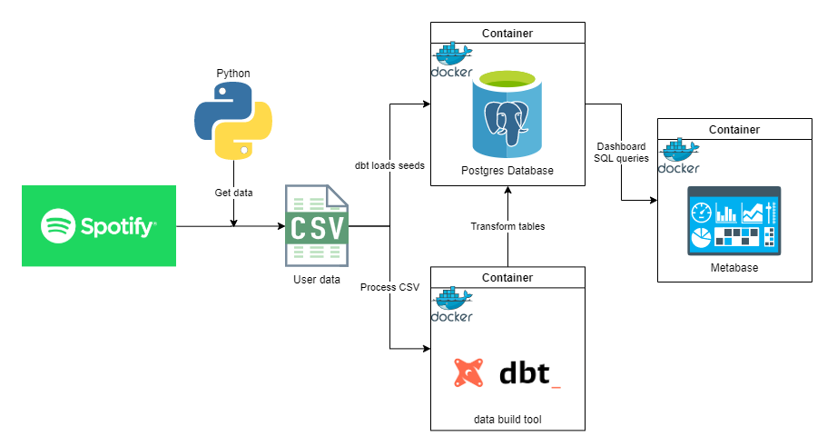
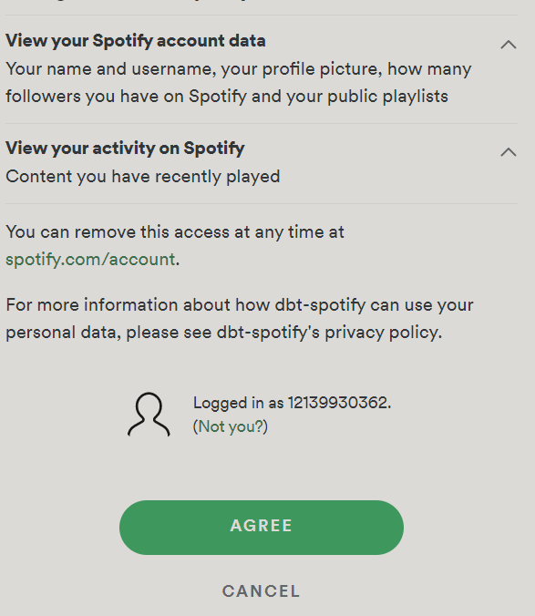
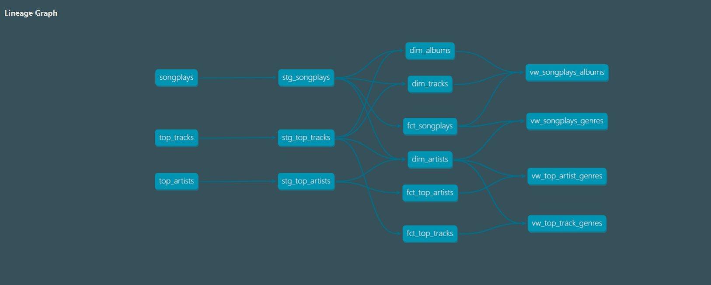
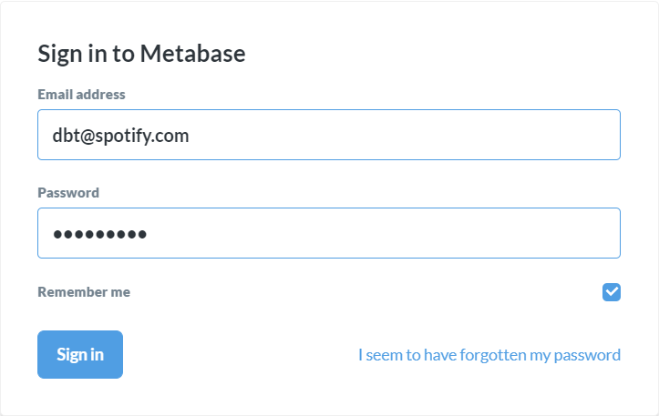

# Spotify User Analytics

## Introduction
In this project, we will be analyzing our listening history, top tracks & artists, and genres from Spotify. Here are the tools that we will be using:
- Python - Scraping data from Spotify API endpoints and saving files to CSV
- Postgres - Our database wherein data will be stored into and queried from
- dbt (Data Build Tool) - Data modeling tool to transform our data in staging to fact, dimension tables, and views
- Metabase - Dashboarding tool to analyze our data
- Docker - Containerizing our applications i.e. Postgres, dbt, and Metabase

## Project Files
- app
    - main.py - Our main ETL script that fetches data from the Spotify API endpoints and saves them to CSV
    - util.py - Utility helper file that contains a custom class **SpotifyUtil**
    - config_template.py - This is where we will store our credentials
- dbt
    - models - Contains the sql scripts and schema.yml files that will be used when we run our transformations
    - dbt_entrypoint.sh - Script that will server as our entrypoint when running the `dbt` container
    - Dockerfile - Contains the commands to create the custom Docker image
    - dbt_project.yml - YAML file to configure dbt
    - packages.yml - YAML file for test dependencies
    - profiles.yml - YAML file to configure connection of `dbt` to `postgres`
- metabase
    - metabase.db - Metadata database of Metabase for the dashboard
- docker-compose.yml - YAML file to orchestrate Docker containers composition

## Workflow
The diagram below illustrates the systems design and how the workflow will go.



Let's break this down into major steps
- Setup
- Get Spotify data
- Build Docker containers
- Transform, model, and load data to Postgres DB using dbt
- Serve to Metabase dashboard

## Setup
- `cd` to this directory
- Open a terminal, create a Python virtual environment using:


    ```
    Windows
    > python -m venv venv

    Mac/Linux
    $ make build

    ```
    then activate it by executing 

    ```
    Windows:
    > venv\Scripts\activate.bat
    ```
    (For Windows) Install dependencies using:
    ```
    > python -m pip install -r requirements.txt
    ```
- While dependencies are being installed, navigate to [Spotify Developer Page](https://developer.spotify.com/dashboard/login) and login
- Create an app and note down the `Client ID` and `Client Secret`, make sure to add a redirect uri in `Settings` i.e. `http://localhost:8888/callback/`
- Fill the details in [config_template.py](app/config_template.py) and rename it to `config.py`

## Get Spotify data
- Run the main Python script to fetch the data from Spotify using:

    ```
    Windows
    > python app\main.py

    Mac/Linux
    $ make run
    ```
- While the script is running, it will redirect to a webpage that looks like the one below, and just click `AGREE` 
    
    

    p.s. follow [me](https://open.spotify.com/user/12139930362) for nice tunes! 😁

## Build Docker containers
Now that we have the CSV files in the `data` folder, we can now build our Docker containers using this command:
```
docker-compose up
```

This command will build our `dbt`, `postgres`, and `metabase` containers. This will also run our data loading, transformations, and modeling in the background.

## Transform, model, and load data to Postgres DB using dbt
During `docker-compose`, dbt runs the following commands
- `dbt init spotify_analytics`: Creates the project folder
- `dbt debug`: Checks the connection with the Postgres database
- `dbt deps`: Installs the test dependencies
- `dbt seed`: Loads the CSV files into staging tables in the database in `postgres`
- `dbt run`: Runs the transformations and loads the data into the database
- `dbt docs generate`: Generates the documentation of the dbt project
- `dbt docs serve`: Serves the documentation on a webserver

Navigating to http://localhost:8080 to see the documentation, we can see the lineage graph, a DAG (Directed Acyclic Graph).



This shows us how the CSV files have been transformed to the fact, dimension tables and views.

## Serve to Metabase dashboard

Now that the data is loaded and transformed in our database, we may now view it in http://localhost:3000.
You may need to login, the credentials are

```
email: dbt@spotify.com
password: password1
```



Then you can navigate through, play around, and analyze your data.

## Questions

- What are the more common tracks in my playlists?
- Avg length of playlists?
- What are my favourites (most listened - top 5) genres in my playlists?
- What are my favourites (most listened - top 10) artists in my playlists?
- Am I born at the right decade? (more common release years of tracks in my playlists)
- What are the two keys that please me more? (2 most commons keys on tracks in my playlists)
- How much hipster am I? (avg popularity of tracks in my playlists)
